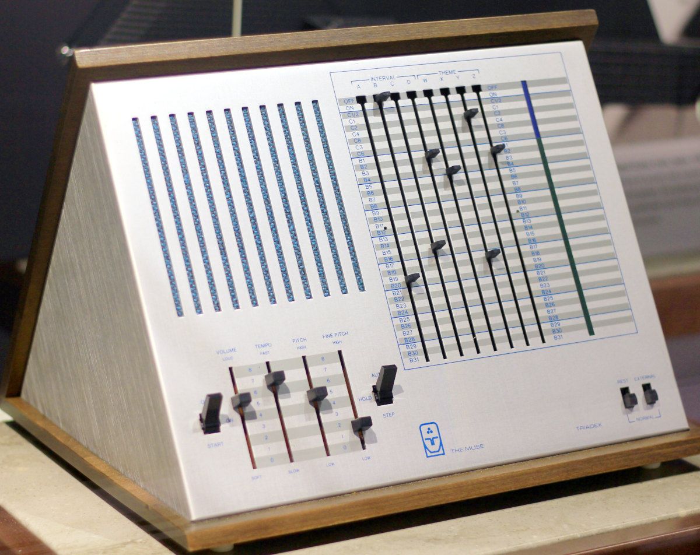

## Triadex Muse

This is a Python implementation of the 1971 [Triadex Muse](https://en.wikipedia.org/wiki/Triadex_Muse) by Edward Fredkin and Marvin Minsky, a pioneering music synthesizer.

Audio output works either by built-in audio synthesis (which requires an audio player that can play raw audio samples) or by MIDI output to an external synth.

### How the Muse works

The Muse uses two binary counters and a 31-bit linear-feedback shift register (with up to four taps: theme sliders W to Z) to generate input signals, which are either repeating or more random patterns, depending on the setting of the theme sliders.

Bits from these signals are then selected by the four interval sliders (A to D) at their respective positions. The resulting four-bit number is finally converted into one of 15 different pitches of the major scale, where A=1, B=2, C=4, D=8 (octave). The pitch one octave up from the base pitch/tonic is repeated because it has *two* four-bit representations (7 and 8). The total range of the Muse is two octaves.

### Basic usage

#### With built-in audio synthesis

If ```MIDI = False``` (line 24), the script sends signed 16-bit audio samples (mono; 44.1 kHz) to standard output, so you need to redirect output to an audio player or a file. You can e.g. pipe output into the ```play``` command from [SoX](https://sox.sourceforge.net/) to listen to it:

```python3 Muse2.py | play -t raw -b 16 -e signed -c 1 -v 1 -r 44100 -q -```

Alternatively, you can redirect output to a file and then import it into Audacity as a raw file.

#### With MIDI output

If ```MIDI = True``` (line 24), output is sent as MIDI notes using the [mido](https://github.com/mido/mido) module. An external synth is required in that case, but many free and open source options exist.

[Dexed](https://asb2m10.github.io/dexed/) is a nice open source FM synth with many great presets, and it also shows which keys are currently played. Or try [amsynth](https://amsynth.github.io/) (Linux/Mac) for some analog warmth. Or run *both* at the same time, e.g. using the [MixedBag1](https://musical-artifacts.com/artifacts/142) ⇨ CorgGalaxy01 patch in amsynth and the vibraphone in Dexed. [Surge](https://surge-synthesizer.github.io/) is also excellent (e.g. using Argitoth ⇨ Keys ⇨ Gumdrops) and even more powerful than Dexed or amsynth.

### Program parameters

The ```evolve``` parameter (line 276) controls how frequently the Muse slider settings are changed (by randomly picking a slider and setting it to a new value). E.g. if it is set to 16 (default), the settings will change every sixteen beats. The new settings are also printed to standard error output.

By default, there is a 10% probability that a switch will be moved to the counter section (OFF/ON/Cx), otherwise it will be set to one of the shift register bits (B1–B31). A switch in the counter section will produce a more repetitive sound, while a switch in a shift register will cause more random and non-repeating melodies.

The ```sec_max``` parameter (line 282) defines maximum duration of the sound, or use 0 for infinite playback. Limiting duration is especially useful when redirecting audio to a file.



### Credits

* [Triadex Muse](https://commons.wikimedia.org/wiki/File:Triadex_Muse_synthesizer_(1972),_Computer_History_Museum.jpg) image by Michael Hicks from Saint Paul, MN, USA, CC BY 2.0 <https://creativecommons.org/licenses/by/2.0>, via Wikimedia Commons

